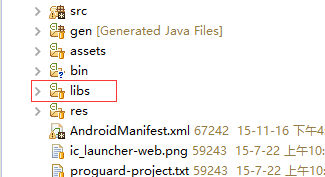

# Android

本SDK适用于 Android 4.0（API Level 14）及以上的设备。

> **导入SDK**

请根据所用IDE选择导入方式：

* Eclipse

  1. 在项目里新建 `lisb` 文件夹\(如果存在就忽略这一步\)。
  2. 将SDK拷贝到项目的 `libs` 文件夹中。

  

* Android Studio

  1. 在 Android Studio 项目的 `app` 文件夹中，新建 `libs` 文件夹。
  2. 将 SDK 中的 `jar` 文件拷贝到工程的 `libs` 文件夹中。
  3. 修改 `app` 文件夹中的 `build.gradle` 文件，添加 `dependencies` 依赖项

```
    compile files('libs/MobAnalyticsSDK-WaveletData.jar')
    ```


> **配置AndroidManifest.xml**

| 权限 | 权限描述 |
| --- | --- |
| ACCESS\_NETWORK\_STATE | 允许应用检测网络连接状态，当网络关闭或者异常时，不发送数据。 |
| READ\_PHONE\_STATE | 允许应用读取手机信息，用户获取deviceID，作为用户的唯一标识。 |
| ACCESS\_WIFI\_STATE | 当获取不到deviceID\(设备为wifi版\)时获取MCA地址，作为用户的唯一标识。 |
| INTERNET | 允许应用访问互联网，用于用户数据的上传。 |
| ACCESS\_FINE\_LOCATION | 可通过GPS获取设备的位置信息，用来修正用户的地域分布数据，使报表数据更准确。。 |

    <manifest……>
    <uses-permission android:name="android.permission.ACCESS_NETWORK_STATE"/>
    <uses-permission android:name="android.permission.ACCESS_WIFI_STATE" />
    <uses-permission android:name="android.permission.INTERNET"/>
    <uses-permission android:name="android.permission.READ_PHONE_STATE"/>
    <uses-permission android:name="android.permission.ACCESS_FINE_LOCATION" />
    <application ……>
    ……
    <activity ……/>
    <meta-data android:value="APPKEY" android:name="VMA_APPKEY" />
    </application>    
    </manifest>```


    APPKEY为开发者在后台申请的应用Appkey；
   > **SDK初始化**

请在Application里的`onCreate()`里进行初始化`VmaAgent.init(this)`;

```
public class MyApplication extends Application {

    @Override
    public void onCreate() {
            super.onCreate();
            initVma();
    }
    private void initVma() {
            VmaAgent.setDebugEnabled(true);
            VmaAgent.setEncryptEnabled(true);
            VmaAgent.init(this);
     }
}
```


注：

1. 如果没有`Application`，请手动添加;

1. `VmaAgent.setDebugEnabled(true)`;\\\开启bebug模式，发布的时候请关闭;

2. `VmaAgent.setEncryptEnabled(true)`;\\\发送数据加密，默认不加密。

> **代码混淆**

如果项目需要混淆的话，请在`proguard`文件里添加如下代码：

```
-dontwarn com.xiaobodata.mobileanalytics.**

-keep class com.xiaobodata.mobileanalytics.**{*;}

-keep interface com.xiaobodata.mobileanalytics.**{*;}

```

