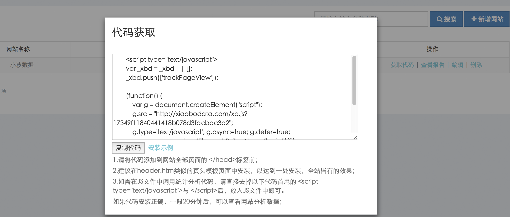
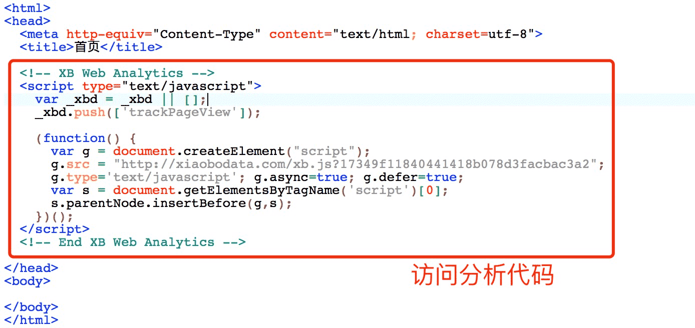

# 代码安装

> **如何获取统计代码**

获取统计代码的具体方法如下：

1.登录您的小波数据帐户

2.点击进入Web Analytics（网站统计分析平台）

3.从网站列表中点击‘获取代码’按钮，打开代码获取页面

4.复制代码后，按照安装说明将代码添加到网站中。




代码目前不支持改造

> **如何手动安装代码**

只有在正确地添加了小波数据代码后，才能获取尽可能准确的流量数据，代码安装过程中需要注意以下几点：

1.请将代码添加到网站全部页面的 </head>标签前；

2.建议在header.htm类似的页头模板页面中安装，以达到一处安装，全站皆有的效果；

3.如需在JS文件中调用统计分析代码，请直接去掉以下代码首尾的 <script type="text/javascript">与 </script>后，放入JS文件中即可。

如果代码安装正确，一般60分钟后，可以查看网站分析数据；




> **如何对AngularJS进行数据统计**


我们知道单页应用实际只加载一个HTML文件，跳转是通过监听hashchange或者pushstate来完成的，因此传统的页面加载统计无法统计到用户在SPA中的跳转，所以需要在代码中手动添加跳转时发送PV的代码。

添加代码的具体方法如下：

```
angular.module('DemoApp') .run(XBAnalyticsProvider);

function XBAnalyticsProvider($rootScope, $location, $timeout) {
    $rootScope.$on('$stateChangeSuccess', function () {
        $timeout(function () {
            _xbd.push(['setCustomUrl', $location.absUrl()]);
            _xbd.push(['trackPageView', document.title]);
        }, 0, false); });


```


