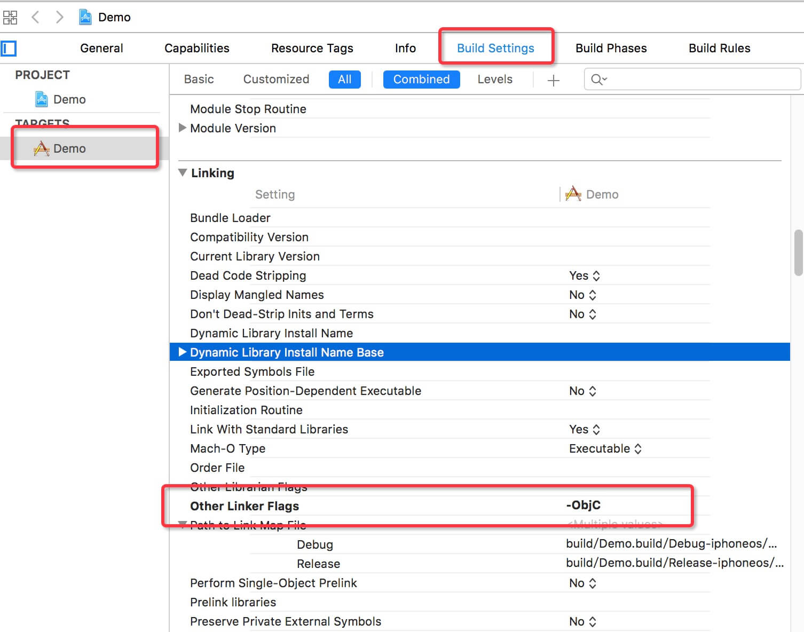

# iOS

SDK适用于 iOS7.0 及以上的系统    

> **导入SDK**

请按照以下步骤将SDK导入到您的项目中：

 1. 解压 iOS SDK 压缩文件。

 2. 添加 ```MobAnalyticsSDK-WaveletData.a``` 和 ```MobAnalytics.h``` 到您的iOS工程中。

 提醒: 勾选 ```Copy items if needed```


> **添加依赖**

| **库名称** | **说明** |
| -- | -- |
| Foundation.framework	 | 基础依赖库|
| Security.framework	 | 用于APP连接圈选页面SSL连接|
| CoreTelephony.framework| 用于读取运营商名称|
| SystemConfiguration.framework| 用于检测网络状况|
| SystemConfiguration.framework| 用于判断网络状态|

提醒: 添加项目依赖库的位置在 项目设置```target``` -> 选项卡```General``` -> ```Linked Frameworks and Libraries```

> **添加编译参数**

在您的工程项目中添加编译参数

 1. 找到 ```Linking``` 设置。
 2. 在 ```Other Linker Flags``` 中添加 ```-ObjC``` 参数，请注意大小写
 
 提醒:```Linking``` 设置位于 项目设置 ```target``` -> 选项卡 ```Build Settings```，左上角选择 ```All```
 
 
 
> **初始化集成**

在 ```AppDelegate.m``` 文件中导入 ```MobAnalytics.h``` ，并在 ```application:didFinishLaunchingWithOptions: ``` 方法中初始化 ```App Analytics SDK```。

```
- (BOOL)application:(UIApplication *)application didFinishLaunchingWithOptions:(NSDictionary *)launchOptions {
    // App ID: 在小波数据官网创建应用后，即可获取App ID。
    [MobAnalytics startWithAppkey:@"您的 App ID"];
        
    return YES;
}
```
