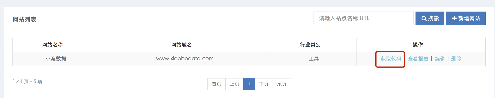

# 代码安装

> **如何获取统计代码**

获取统计代码的具体方法如下：

1.登录您的小波数据帐户

2.点击进入Web Analytics（网站统计分析平台）

3.从网站列表中点击‘获取代码’按钮，打开代码获取页面

4.复制代码后，按照安装说明将代码添加到网站中。

 

> **跟踪原理介绍**

使用小波数据网站统计跟踪网站的流量，您需要在网站的每一个网页中加入小波数据的JavaScript代码。统计代码在创建站点时获取，一个站点对应一个代码跟踪ID。

