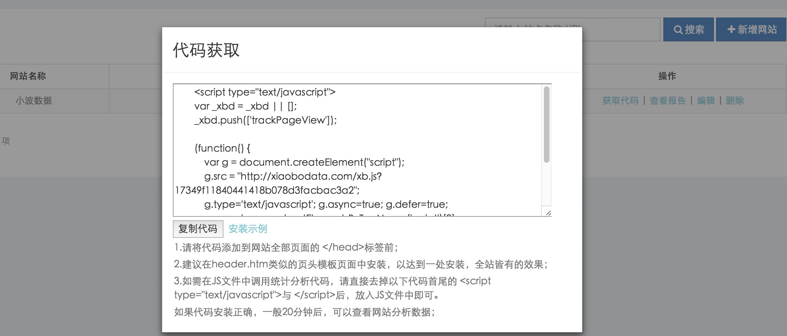

# 代码安装

> **如何获取统计代码**

获取统计代码的具体方法如下：

1.登录您的小波数据帐户

2.点击进入Web Analytics（网站统计分析平台）

3.从网站列表中点击‘获取代码’按钮，打开代码获取页面

4.复制代码后，按照安装说明将代码添加到网站中。

代码目前不支持改造

> **如何手动安装代码**

只有在正确地添加了小波数据代码后，才能获取尽可能准确的流量数据，代码安装过程中需要注意以下几点：

1.代码的安装位置要正确，请将异步分析代码安装在标签&lt;\/head&gt;标记前。

2.一个页面中不要重复安装相同的代码，统计有去重规则，一般不会重复计算。一段代码生效后，另外一段代码就会废弃，但建议只安装一段代码。

3.不要对代码有任何编辑操作，随意编辑代码会导致代码无法成功执行，且可能影响到网站页面的显示。

4.在网站的所有页面都安装代码。

